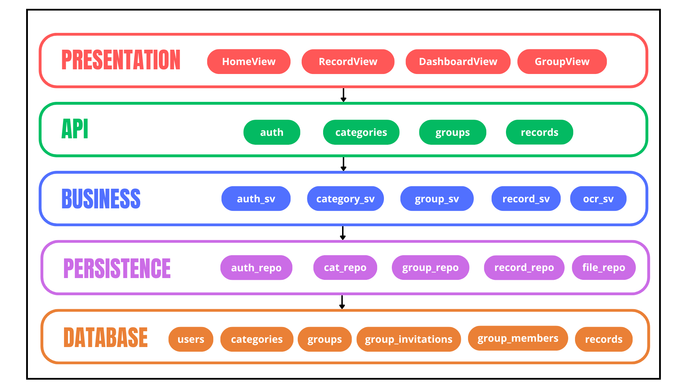
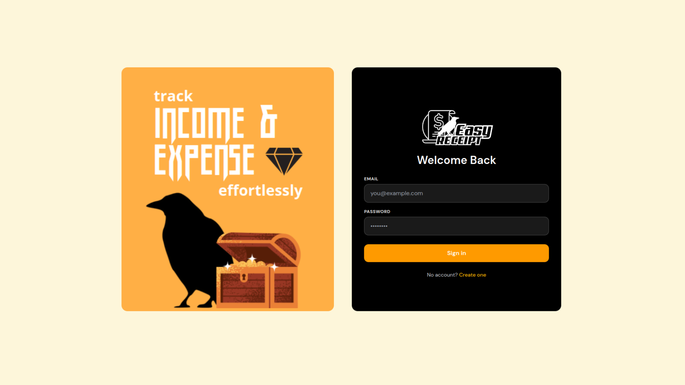
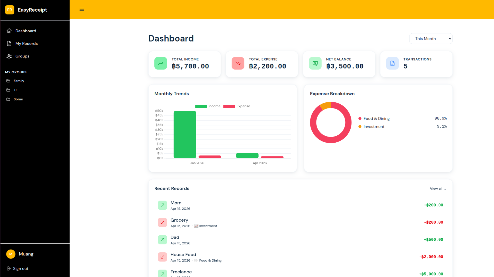
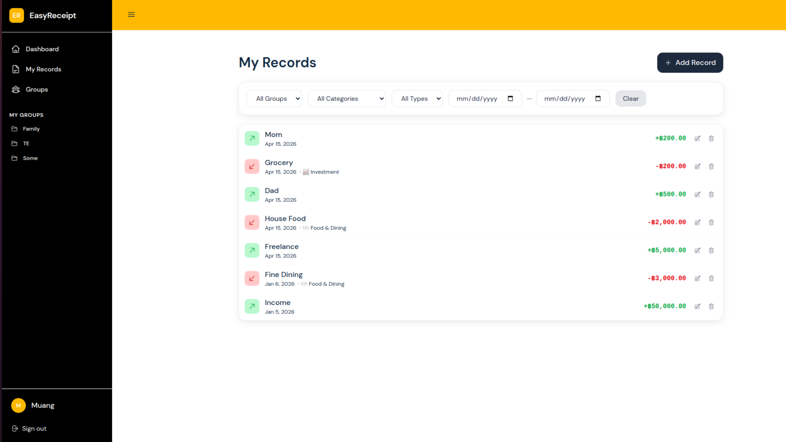
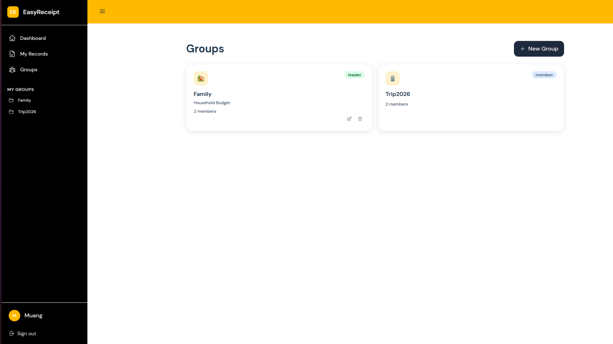
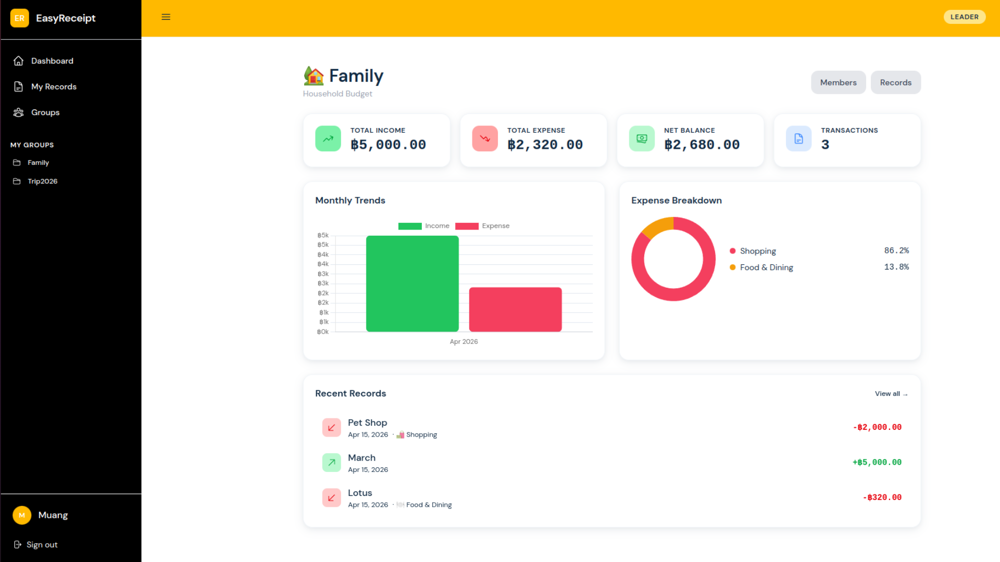
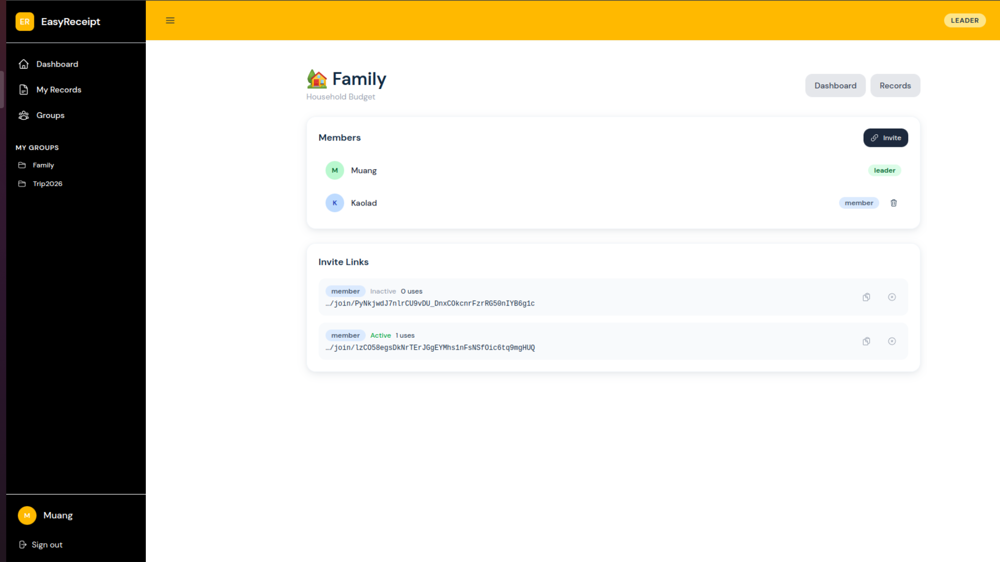
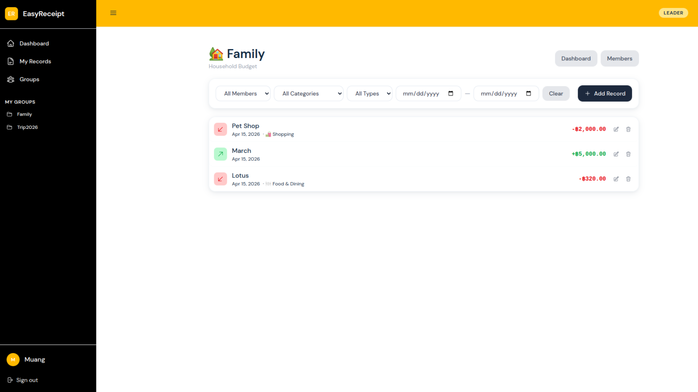

# EasyReceipt 🧾
An income & expense management application with personal and group accounts, receipt scanning, dashboards, and role-based access control.

---

## System Architecture Overview

Both the backend and frontend follow a **layered architecture**. Each layer may only communicate with the layer directly adjacent to it. No layer skipping is permitted.

### Architecture Diagram



#### Layer Definition
```
┌─────────────────────────────────────────────┐
│  Presentation Layer                         │
│  • Get input and display the result         │
│  • Call the          │
└──────────────────┬──────────────────────────┘
                   ▼
┌─────────────────────────────────────────────┐
│  API Layer  (app/api/v1/endpoints/)         │
│  • Validates HTTP input via Pydantic        │
│  • Applies role decorator dependencies      │
│  • Returns Pydantic response schemas        │
└──────────────────┬──────────────────────────┘
                   │  calls ↓
┌─────────────────────────────────────────────┐
│  Business Layer  (app/services/)            │
│  • All business logic lives here            │
│  • Enforces ownership & group membership    │
└──────────────────┬──────────────────────────┘
                   │  calls ↓
┌─────────────────────────────────────────────┐
│  Persistence Layer (app/repositories/)      │
│  • All DB queries (SQLAlchemy)              │
│  • Returns ORM model instances              │
└──────────────────┬──────────────────────────┘
                   │  talks to ↓
┌─────────────────────────────────────────────┐
│  Database  (MySQL via aiomysql)             │
└─────────────────────────────────────────────┘
```

### Frontend Layers

```
Views  →  Stores (Pinia)  →  API modules  →  Axios client  →  Backend
```

---

## User roles & Permissions

### Roles Definition

| Role | Definition |
|---|---|
| `leader` | The administrative of the group. This user has full authority over the group’s, including financial management and membership governance. |
| `member` | A collaborative role designed for active contributors. Members can track and manage financial data but do not have authority over the group’s composition. |
| `viewer` | A read-only role intended for stakeholders who need to monitor the financial data without the ability to modify it. |

### Role Permission
The following table outlines the specific capabilities assigned to each role within a group:

| Role | View Records | Add/Edit Records | Invite Members | Remove Members |
| :--- | :---: | :---: | :---: | :---: |
| **Leader** | ✔ | ✔ | ✔ | ✔ |
| **Member** | ✔ | ✔ | ✗ | ✗ |
| **Viewer** | ✔ | ✗ | ✗ | ✗ |

---

## Technology Stack

| Component | Technology |
|---|---|
| Frontend | Vue.js + TypeScript |
| Backend | FastAPI |
| Database | MySQL via SQLAlchemy |
| Container | Docker + Docker Compose + Nginx |
---

## Installation & Setup Instructions


### Clone the repository

```bash
git clone https://github.com/ParimaSA/EasyReceipt
cd EasyReceipt
```

### Local Development

**Backend:**
1. Prepare the environment
```bash
cd backend
python -m venv venv && source venv/bin/activate
```
2. Install the dependency
```bash
pip install -r requirements.txt
```
3. Create .env file from example
```bash
cp .env.example .env          # edit DATABASE_URL etc.
```
4. Migrate the database
```bash
alembic upgrade head
```

**Frontend:**
1. Install the dependency
```bash
cd frontend
npm install
```
---

## How to run the system

### Docker
```bash
docker-compose up --build
```

Access the services:
- Frontend: http://localhost:80
- Backend API: http://localhost:8000
- API docs (Swagger): http://localhost:8000/docs

### Manual Startup (Local Development)

**Backend:**
```bash
cd backend
source venv/bin/activate        # activate the environment
uvicorn app.main:app --reload
```

Access at: http://localhost:8000


**Frontend:**
```bash
cd frontend
npm run dev
```

Access at: http://localhost:5173

---
## Screenshots of the system

| Home Page | 
| :---: |
|  |
### Personal Account
| Dashboard | Record |
| :---: | :---: |
|  |  |

### Group Collaboration
| Group List | Group Dashboard |
| :---: | :---: |
|  |  |

| Group Member | Group Record |
| :---: | :---: |
|  |  |
